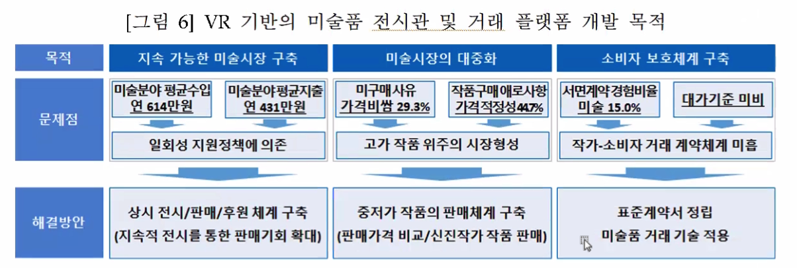
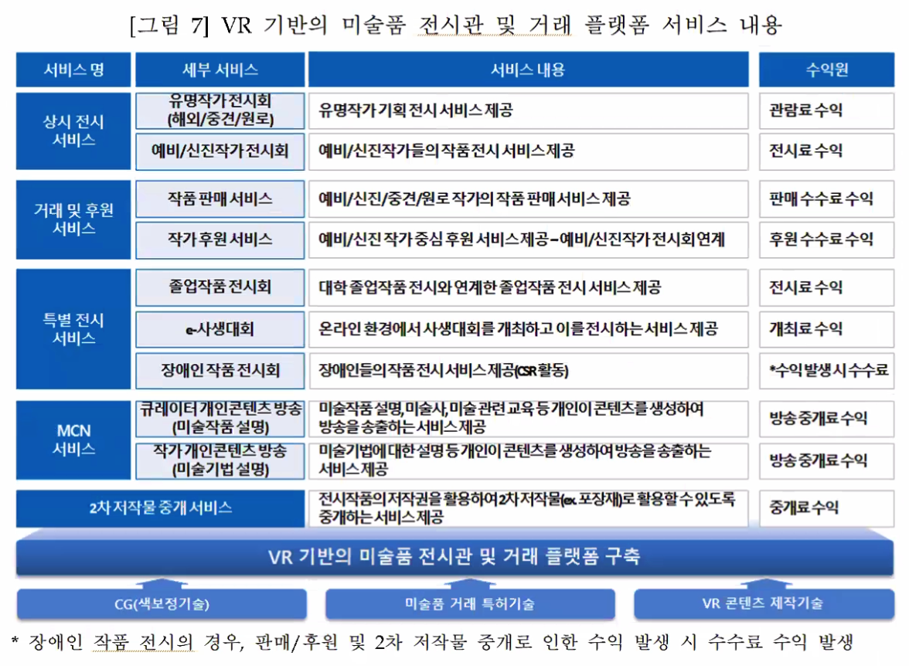
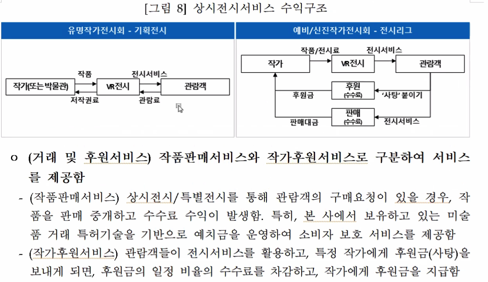
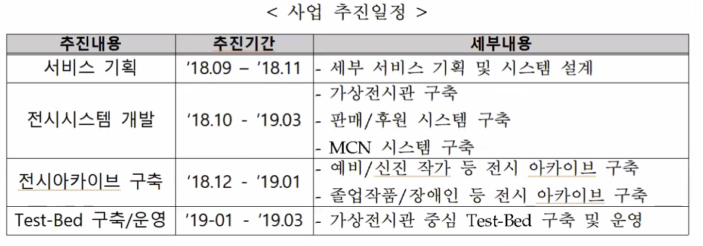
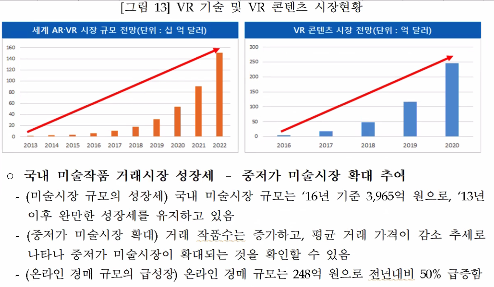
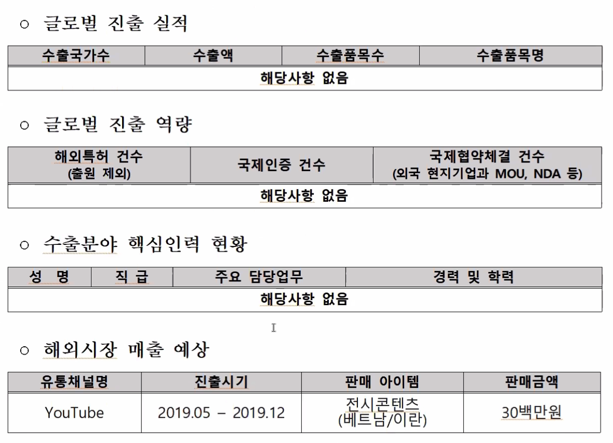
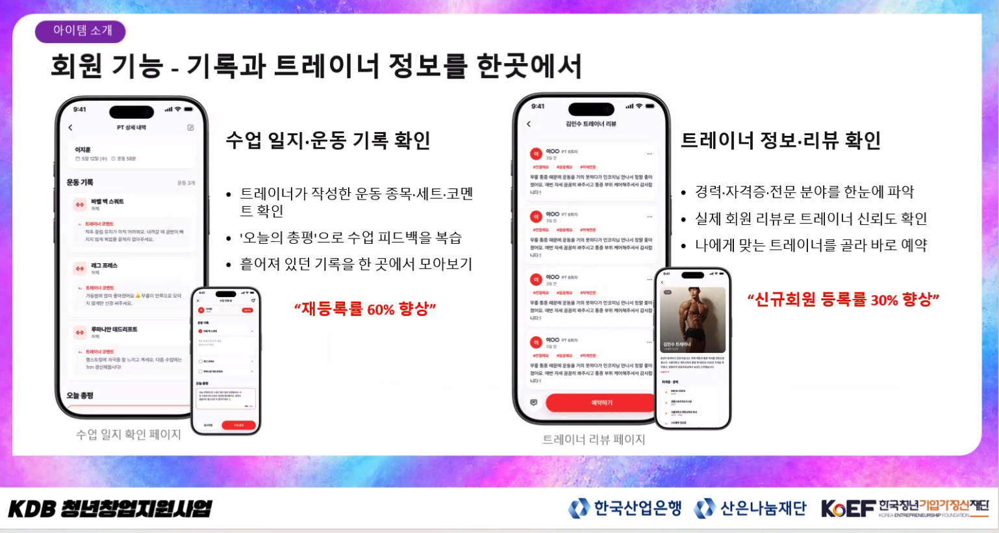
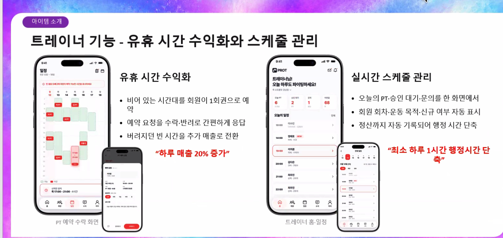

# 미팅 내용

PSST 구조는 중요하니까 사업계획서 쓸 때 중요한 구조임.

창업 아이템의 차별성

- (거래 플랫폼 구축) 기존 플랫폼이 서비스하고 있지 않은 온라인 미술품 거래 특허 기반 미술품 거래의 안전한 서비스를 제공할 수 있어 공급자 소비자 유인이 용이함
- (상대적 소외계층 중심 서비스 제공) 예비/신진작가, 장애인, 졸업작품/사생대회 등 미술시장의 상대적 소외계층 중심의 서비스를 제공함

국내외 목표 시장

- 고품질 VR 전시관을 통한 VR-전시시장 선점 전략
  - (작가) 작가들의 경우에는 VR을 통한 상시전시체계 및 판매체계 구축이 가능하며, 특 히, 창작자 후원금을 모집할 수 있는 체계를 구축함으로써 지속가능한 작품 활동을 지원받을 수 있는 체계를 마련할 수 있음
  - (관람객) 비교적 쉽게 전시 콘텐츠를 접할 수 있는 기회가 확대되고 있으며, 무료로 관람할 수 있는 콘텐츠(예비/신진작가 전시)를 구축하여 소비자를 유인함
- 글로벌 플랫폼을 통한 콘텐츠 침투 전략
  - (글로벌 플랫폼 활용) 해외 시장의 경우, 직접적인 시장 공략보다는 YouTube 등과 같은 글로벌 플랫폼을 활용하여 콘텐츠를 유통하는 전략을 수립함

### 1. 문제인식

#### 1-1. 창업 아이템 개발 동기

외국인이 한국 서비스를 이용한데, 불편함을 겪고 있는 것들을 리스트업

1. 그리고 나서 우리 리뷰같은 경우에도 문제점이 있음.
   어떻게든 지금 외국인 전용 리뷰가 있긴 하지만 - 실제 국가별, 인종별 내용들은 부재한 상황. (유튜브 콘텐츠 보더라도 사람마다 다르고, 국가별로, 인종별로 도 다르다.)
   이런 방식으로 문제제기 를 해주어야 하는 파트임.
   똑같이 외국인으로써 (우리나라 사람이 아닌 사람) 동일하게 묶어버리는 것이 아니라, 이들에 대한 특성들에 이들끼리 뭔가 정보를 공유할 수 있게끔 만들어줘야 한다는 문제인식. 들이 드러나야 할 듯?

이런 문제점들을 도출 한다고 했을 떄, 이렇게 각가의 문제점들을 어떤 방법으로 해결하겠다. 라는 것들을 공유해야 함.

#### 1-2 창업아이템의 목적(필요성)

```예시
• 지속 가능한 미술시장 구축
- (문제점) 미술분야의 평균수입이 연 614만원 수준(2015년 기준), 평균 지출액은
431만원(2015년 기준) 수준으로 나타났으며, 대부분의 작가들이 일회성 지원정책 에 의존하고 있는 경향을 보임
- (해결방안) 상시 전시/판매/ 후원체계를 구축하여, 작가들이 판매기회 확대와 안정 적 작품활동을 수행할 수 있도록 시장을 조성함
• 미술시장의 대중화 - 작가 및 전문가 중심의 시장형성
- (문제점) 미술작품의 미구매 사유로 가장 높게 나타난 것이 가격이 비싸다는 것(29.3%) 이며, 작품구매에서 어려움을 겪는 점이 가격적정성에 대한 모호성(44.7%)로 나타난 것 으로 봤을 때, 고가 작품 위주의 시장이 형성되어 있는 것으로 판단할 수 있음
- (해결방안) 예비/신진 작가의 작품을 포함한 중저가 작품의 판매체계를 구축하고, 판매가격 비교 등이 용이한 환경을 조성하여 미술시장의 대중화가 가능함
• 소비자 보호체계 구축
- (문제점) 미술작품 시장에서 서면계약을 경험한 비율이 15.0% 수준에 불과하고, 대가기준에 대한 근거가 미비하여 작가와 소비자 간의 거래계약 체결 프로세스가 미흡한 상황임
- (해결방안) 표준계약서의 정립 및 미술품 거래 기술(기 보유특허)을 적용함으로써 소비자 보호체계를 구축할 수 있음
```

우리는 이러한 해결책들을 하나의 솔루션으로 묶어버릴 것.
지금 우리가 제공하려고 하는 게
K-beauty와 관련된 콘텐츠, 외국인들이 한국생활에 조금 더 라이프관점에서 적응할 수 있도록 만드는 콘텐츠, 그리고,
실질적으로 리뷰에 대한 데이터들을 그들끼리 만들어서 생성해서 공유할 수 있게 만들어준다는 게 특성임.



### 2. 실현 가능성

#### 2.1. 창업아이템 사업화 전략

예시.

여기서는 어떤 서비스가 있어요~ 라는 것들을 조금 더 구체적으로, 상세하게 설명한 예시임. 중요하다. 라고 판단을 하는 게 수익원인데, 수익원들은 어떤 수익들을 창출할 수 있는지, 이것을 하나로 뭉뚱그려 수익 제시를 해도 되고, 서비스 별로 수익원을 다르게 적용해도 됨.

이러한 서비스들이 우리 플랫폼 내에서 이루어질 수 있다 라는 걸 조금 더 설명을 해줘야 함. 이런 식으로.

그래서 이 사업계획서에서의 약간 특성적인 부분은 위에 처럼 서비스 리스트들이 나오면 각각의 서비스들에 대해서
이해관계자와 어떻게 연결이 되는지에 대한 각각의 give and take를 도식화를 한 것들이 있음.



그래서 고객은 누구고, 이걸 도와주는 사람은 누구야. 라고 명확하게 정의를 해주는 것이 필요하다.

사업 추진 일정


#### 2.2. 창업아이템 시장분석 및 경쟁력 확보 방안

시장분석을 탐샘송이라는 방법을 쓰기도 하고
아니면 탐샘솜에 대해서 우리가 명확학 추정하기 어렵다면

그래프로 우리가 성장하고 있어요. 라는 걸 설명을 해줘야 하는데,
우리로 치면, 우리나라에 들어와 있는, 외국인과 관련된 시장들이 계속 성장을 하고 있다 라는 내용들을 설득해줘야 함.
이런 것들은 시장 추정 자료


이런식의 시장 추정자료 또는 근거있는 자료들을 제시를 엑셀파일로 깔끔하게 만들어서 제시할 필요가 있따.

우리 창업/사업계획서도
문제인식, 먼저 나오고, 이거를 해결하기 위한 솔루션 나오고,
이 솔루션을 조금 더 구체화 시키기 위한 스케일업 들이 나와줘야 함.

# 3. 성장전략

## 3.1. 자금소요 및 조달계획

## 3.2. 시장진입과 성과 창출 전략 (이게 아주아주 중요함)

### 3.2.1 내수시장 확보 방안 (경쟁 및 판매 가능성)



---

# 교수님이 보여주셨던 예시

## 문제 정의

트레이너와 회원이 겪는 문제, 그리고 니즈
트레이너 49명•회원 78명 대면 인터뷰로 확인한 현장의 페인포인트

트레이너
현장의 문제
비효율적 회원 관리

- 회원.스케줄.정산이 흩어져 통합 관리 시스템이 없음
  트레이너 49명 중 88%가 관리 시스템 부재로 불편 호소

원하는 니즈
빈 시간을 수익으로

- 예약 없이 버려지는 유휴 시간을 매출로 전환하고 싶음
- PT 판매 채널 부재

회원
현장의 문제
PT 관리 시스템의 부재

- 예약. 출석•기록•트레이너 정보가 여러 채널로 분산
  회원 78명 중 92%가 정보 분산으로 불편 호소

원하는 니즈
1회 단위 PT 구매

- 원하는 시간에 PT를 신청할 수 없는 현 시스템 개선 희망
- 트레이너 정보와 리뷰 보기 희망

회원의 불편함은 곧 트레이너가 놓치는 매출, 둘을 잇는 시스템이 필요합니다

이런 식으로 우리 프로젝트에서 한 쪽에서만 보는 게아닌 다방면 시야에서 볼 수도 있구나~ 를 알아가는 예시

공급자 관점에서의 문제점을 발견할 수 있다는 말.
외국인들에게 어떤 서비스를 제공하려고 하는데, ~~가 불편하더라 등등
의 문제점들과 연결이 될 수도 있다.

---

## 활동 내용

고객의 목소리를 구체적 피벗으로 연결
누적 140명 대면 인터뷰에서 얻은 힌트로 세 차례 방향을 전환
1차 피벗
39명 인터뷰
"텍스트를 일일이 작성하기 힘들어요"
"회원 기록 작성에 시간이 너무 오래 걸려요

주요 인사이트
관리 둘의 가치는 '기록이 아니라 '기록 시간 단축

새롭게 알게 된 사실
트레이너는 간편하고 전문성있는 일지를 원하고, 실제 일지를 받는 회원과 일지를 받지 않은 회원 중 재등록률 차이가 60%이상 차이가 났다.

2차 피벗
98명 인터뷰
"100만원짜리 PT 인데 트레이너를 제 마음대로 고들 수 없어요"
"배달앱처럼 리뷰를 보고 싶어요

주요 인사이트
회원의 트레이너 선택은 '정보•리뷰 기반 의사결정

새롭게 알게 된 사실
PT를 받지 않는 회원 중 27명이 트레이너를 신뢰 할 수 없다는 말을 했다.

3차 피벗
총 140명 인터뷰
"예약 없는 빈 시간이 아까워요
"출장이 찾아 유동적으로 예약하고 싶어요"

주요 인사이트
유휴 시간은 트레이너의 매출 손실, 회원은 유동적 1 회권을 원함

새롭게 알게 된 사실
PT를 받지 않는 회원 중 53명이 PT를 받아보고 싶다 고 했지만 그 중 42명이 10회 PT는 부답스러워 함

"만들고 싶은 것"에서 고객 시장이 원하는 것"으로

이렇게 인터뷰들을 통해서 어떤 방식으로 아이템을 고도화해나갔는지.

## 아이템 소개



나도 이런 식으로 아이템소개 이미지와 장표 만들어야 함


BMC도 작성 해보면 좋을 듯?

---

먼저 노션에다가 정리해둔 것들을가지고
한글파일, pt로 옮겨서 전체적인 그림 그려보자.
우리가 논리적으로 봤을 떄 어떤 것들을 문제로 인식을하고,
솔루션의 방향성을 어떤 방향으로 제시를 할 것인지 그리고 여기에 대한 스케일업 전략, 특히나 시장 진입 관련된 전략들을 어떤 방식으로 구체화 할 것인지를 명확하게 설정해서 적어야 함.

---

가장 중요한 것을 어떤 자료를 통해서 계산했는지 등의 출처를 아주 명확하게 파악해야 함.

문제인식 단계에서
솔루션 단계에서 설명하기도 함
