# 콘텐츠 기능 레퍼런스 조사

7/26 발표용 · 기획/개발

지도랑 리뷰, 국가·인종별 필터는 프로토타입에 이미 넣음.
다른 앱들은 콘텐츠(인플루언서 영상·글)를 어떻게 소비하게끔 만들었는지 참고해서, 우리 콘텐츠 탭에 뭘 넣을지 같이 정해야 함.

---

## 실제 앱 화면 (앱별 스크린샷)

직접 찍은 실제 앱 화면을 앱별로 모음. (아래 기능 설명엔 패턴 목업, 진짜 화면은 여기)
새 스샷은 `assets/design-ref/screenshots/<앱>/`에 넣고 이 아래에 앱별로 추가하면 됨.

### Beli (지역 랭킹·리스트·피드)

- 초기 화면
  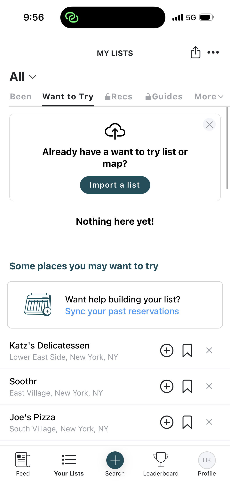
- 다녀온 곳 리뷰 추가 가능
  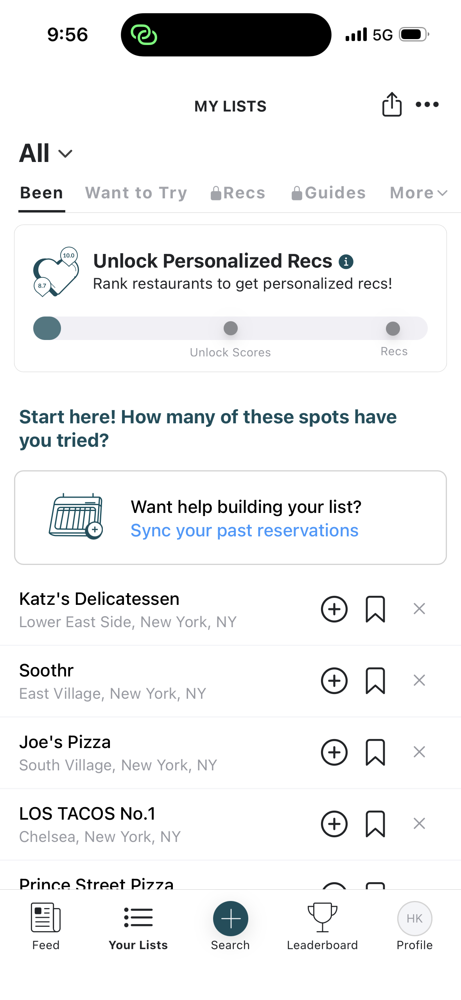
- 음식점 화면 — 내 리스트에 넣거나 후기 어땠는지 적을 수 있음
  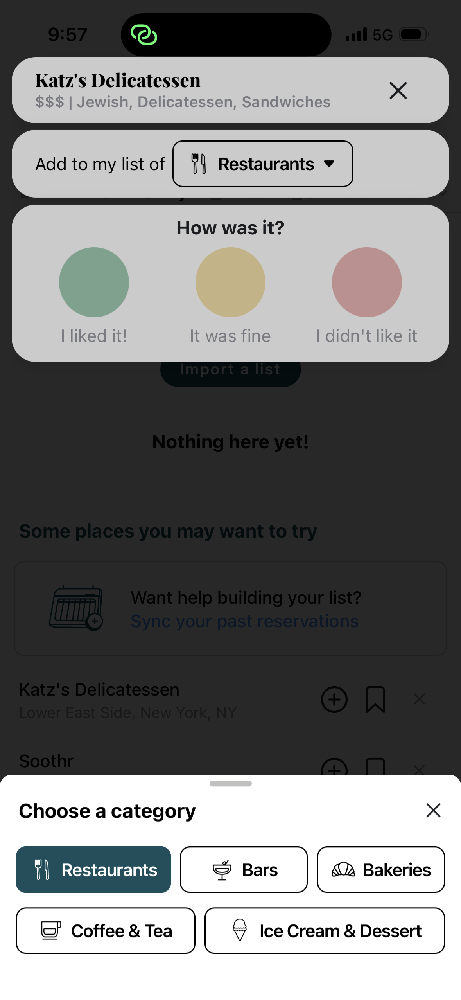
- 리더보드 랭킹
  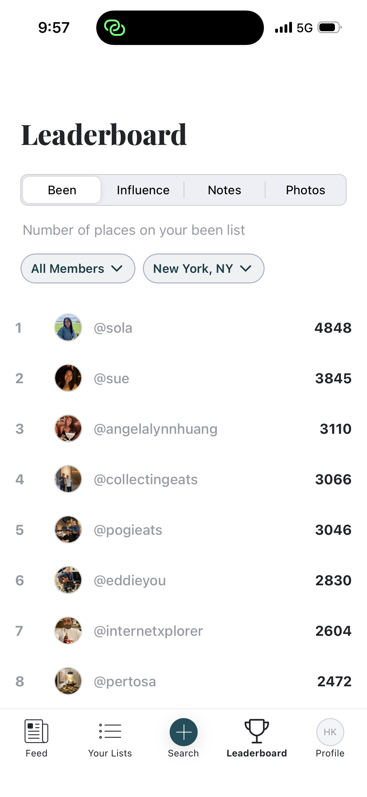
- 콘텐츠 소비 피드 화면
  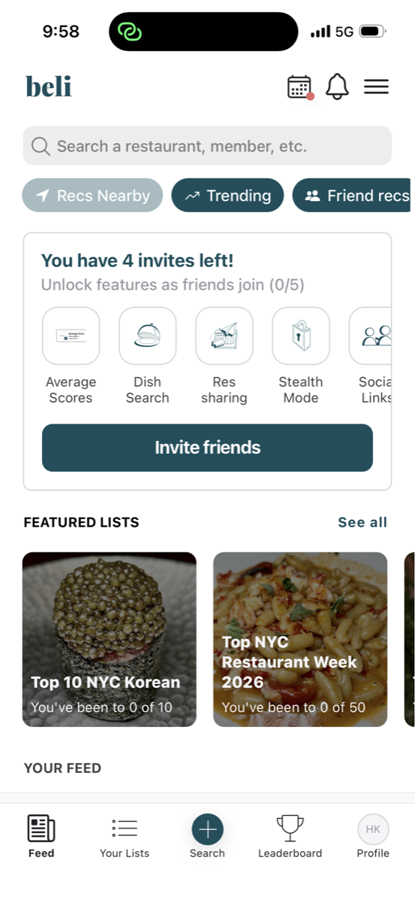

### 샤오홍슈 · 레몬8 (2열 카드 피드)

- 메인 페이지 (2열 카드 피드)
  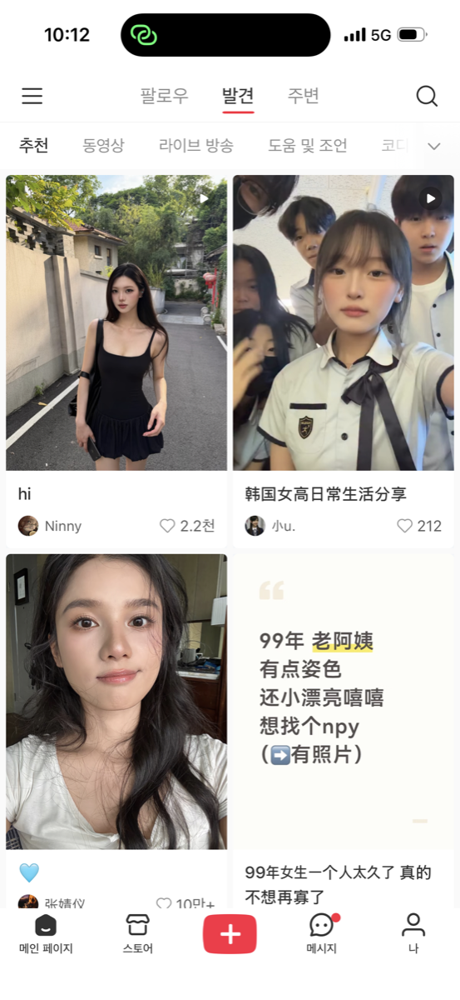
  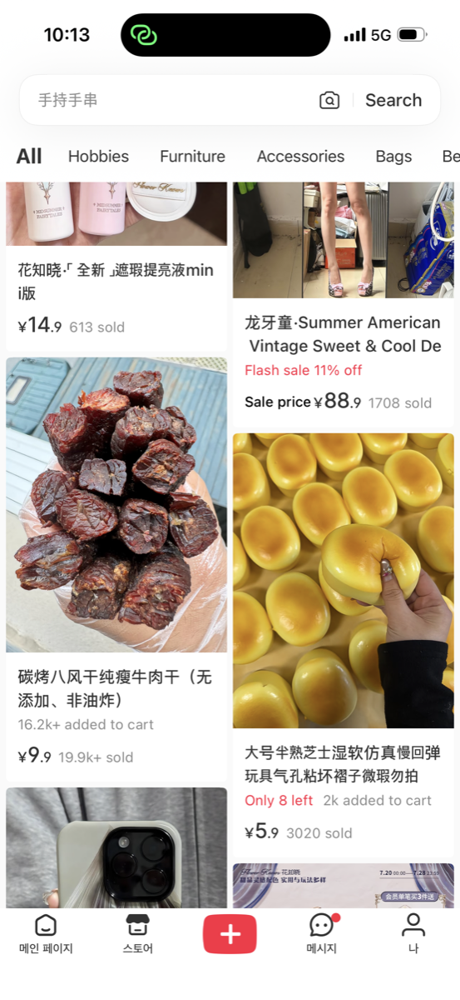
  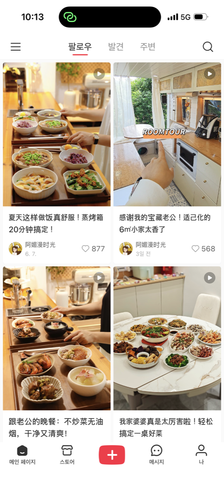
  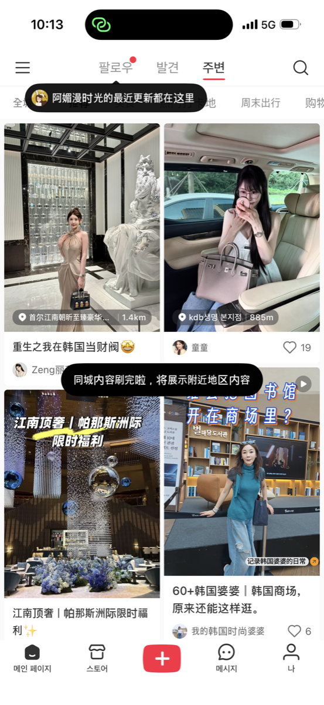
### 틱톡 · 인스타 릴스 (숏폼 세로)
> 📸 세로 영상(오른쪽 버튼 보이게) → `screenshots/tiktok/`

### 인스타그램 (사진 피드)
> 📸 피드 화면(사진+좋아요+캡션) → `screenshots/instagram/`

### 그 외 (Yelp · 구글 로컬가이드 · 네이버 마이플레이스)
> 📸 크리에이터 뱃지·레벨, 지역 리뷰어 랭킹 → `screenshots/etc/`

---

## 콘텐츠 소비 방식 (형식별)

크리에이터가 올리고 남들이 소비하는 형식들. 우리가 뭘로 보여줄지가 핵심.
`★` 우리 1차 후보 · `△` 검토 · `(기존)` 이미 만든 콘텐츠

**1. 숏폼 세로 영상 `★`**
- 풀스크린 세로, 위아래 스와이프
- 예시: 틱톡 · 인스타 릴스 · 유튜브 쇼츠

**2. 사진 카드 2열 `★`**
- 사진+짧은 제목 카드를 2열로
- 예시: 샤오홍슈 · 레몬8 · 핀터레스트

**3. 사진 피드형 `★`**
- 큰 사진 한 장씩, 팔로우한 사람 위주
- 예시: 인스타그램

**4. 블로그·롱폼 글 `(기존)`**
- 사진+긴 글, 정보량 많고 검색 유입 강함
- 예시: 네이버 블로그 · 브런치 · 미디엄 · 티스토리

**5. 웹진·매거진 `(기존)`**
- 에디터가 주제별로 편집, 잡지 느낌
- 예시: Creatrip · 오늘의집 매거진 · 29CM 콘텐츠

**6. 롱폼 영상·브이로그**
- 긴 영상, 깊은 정보·스토리
- 예시: 유튜브

**7. 라이브 방송**
- 실시간, 채팅·질문·즉석 반응
- 예시: 인스타 라이브 · 트위치 · 그립(쇼핑라이브)

**8. 큐레이션 리스트**
- "성수 카페 5곳"처럼 묶어서
- 예시: 카카오맵 테마 · 캐치테이블 큐레이션

**9. Q&A·커뮤니티 글**
- 질문·답변, 스레드 토론
- 예시: 레딧 · 네이버 카페 · 지식iN

> `△` 오디오·팟캐스트(스포티파이 등)는 우리랑 거리 있어 일단 뺌.
> `★` 세 개(숏폼·사진카드·사진피드)가 "올리고 소비"의 뼈대 → 아래에서 상세.

---

## 핵심 3가지 (우리 콘텐츠 첫 화면 후보)

### 1. 숏폼 세로 영상 (틱톡·릴스·쇼츠)

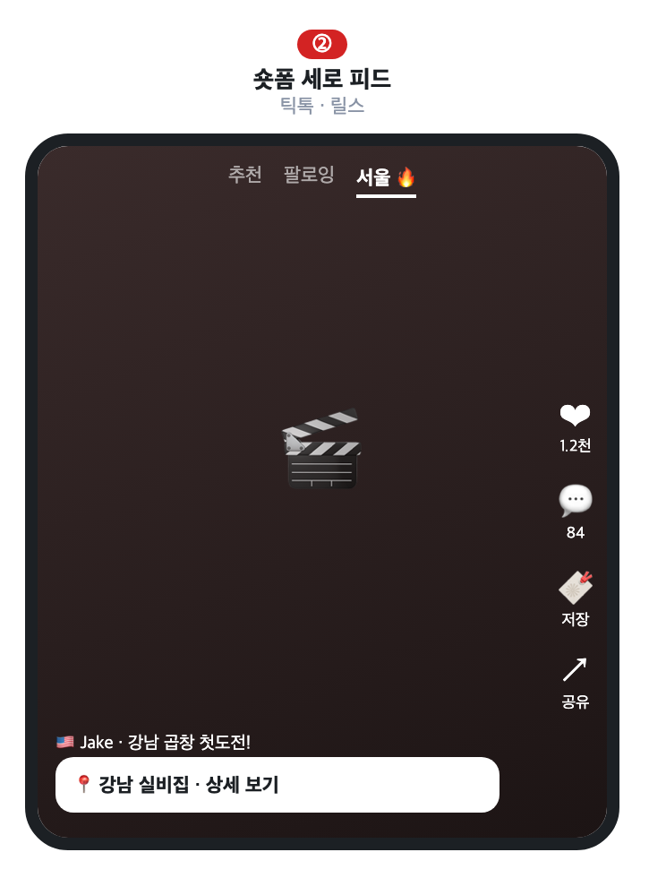

**왜 좋냐**
- 풀스크린 세로 + 위아래 스와이프 → 몰입·체류시간 김
- 액션 버튼(♥·저장·공유) 오른쪽 세로 = 오른손 엄지에 최적
- 위 탭을 "근처" 대신 동네 이름("서울")으로 → 내 주변 뜨는 느낌

**우리는**
- 영상은 세로 풀스크린으로
- 영상 위 `📍장소 보기` 버튼 → 지도·리뷰(이미 있음)로 바로 연결

참고: [TikTok Newsroom](https://newsroom.tiktok.com/tiktok-nearby-discover-whats-happening-around-you) · [틱톡 UI 분석](https://www.linkedin.com/pulse/why-tiktoks-ui-amazing-uxui-analysis-series-part-1-mesai-memoria)

### 2. 사진 카드 2열 (샤오홍슈·레몬8)

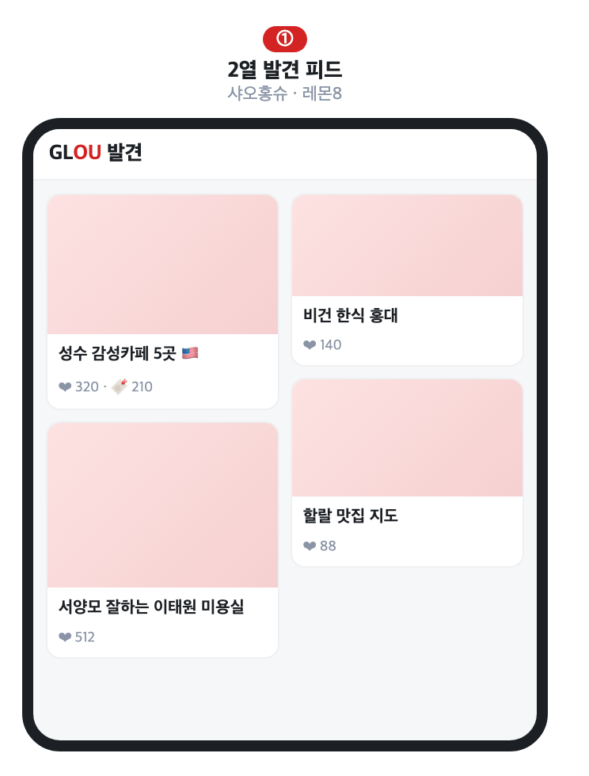

**왜 좋냐**
- 사진+짧은 제목 카드 2열 → 영상 안 틀어도 훑으면 뭔지 앎
- 글 약한 외국인한테 그림+제목이 훨씬 편함
- 그래서 샤오홍슈는 SNS보다 검색 앱처럼 쓰임

**우리는**
- 콘텐츠 첫 화면을 이 2열 카드로
- 카드에 국기(🇺🇸)만 붙여도 "내 나라 사람 콘텐츠"가 한눈에

참고: [PingWest](https://en.pingwest.com/a/11673) · [Medium 분석](https://medium.com/@chgnycnyc/xiaohongshu-a-social-media-app-with-search-engine-capabilities-dbd257181306)

### 3. 사진 피드형 (인스타그램)

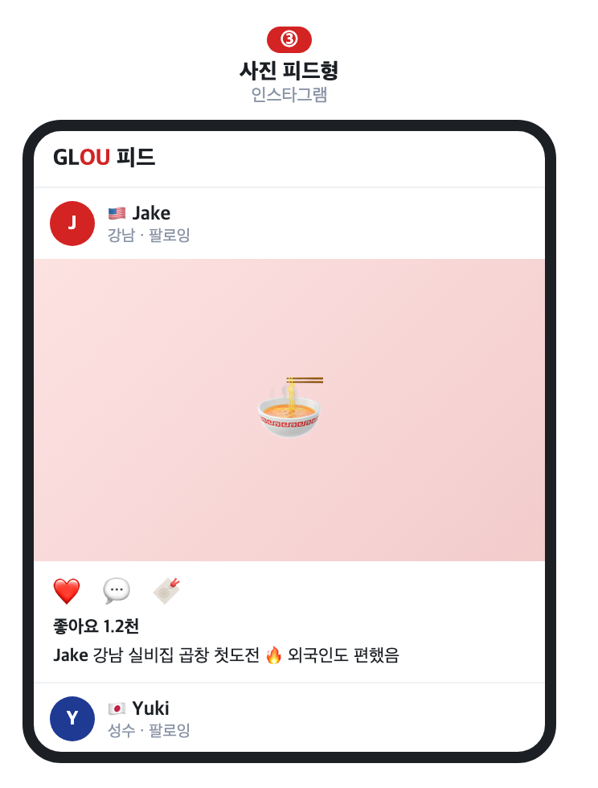

**왜 좋냐**
- 큰 사진 한 장씩, 팔로우한 사람 위주로 봄
- 만들기 쉬움(사진 한 장+글) → 크리에이터 올리기 부담 적음
- 팔로우 관계라 계속 돌아옴

**우리는**
- 팔로우 기반 피드 탭(내가 따라둔 크리에이터 글)
- 사진에 장소·리뷰 태그 → 사진에서 장소로 연결

---

## 부수 기능 (콘텐츠 계속 보게 / 크리에이터 계속 올리게)

콘텐츠 형식 위에 얹는 장치들. 콘텐츠 자체는 아니고, 더 보게·더 올리게 만드는 것.

### 지역구 일짱 주간 랭킹 (Beli·포스퀘어)

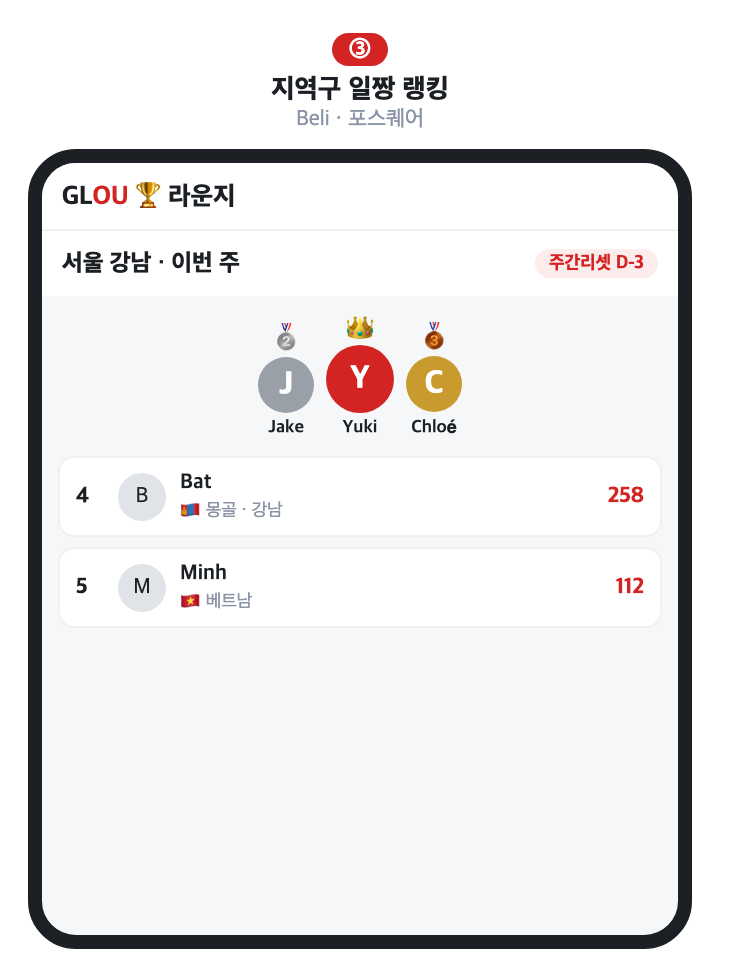

- 지역별 주간 랭킹, 매주 리셋 → 순위 지키려 계속 올림
- 1~3위는 왕관 붙여 맨 위 고정
- **우리**: 지역(강남·청주) 고르면 이번 주 1~3위 + 그 사람들 콘텐츠
- 실제 화면: 위 갤러리 Beli 리더보드 참고
- 참고: [TODAY(Beli)](https://www.today.com/food/trends/what-is-beli-app-rcna217748)

### 저장 → 내 지도 (샤오홍슈·인스타)

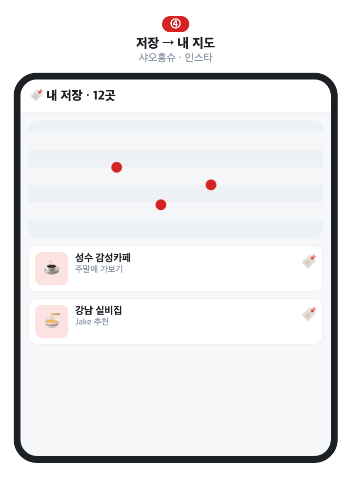

- '좋아요' 말고 '저장' → 나중에 갈 곳 모음
- 저장이 리스트가 아니라 내 지도에 핀으로 → 다시 켜게 됨
- **우리**: 저장을 여행 플래너로, 지도(이미 있음)에 바로 연결

### 크리에이터 뱃지·레벨 (Yelp·구글가이드)

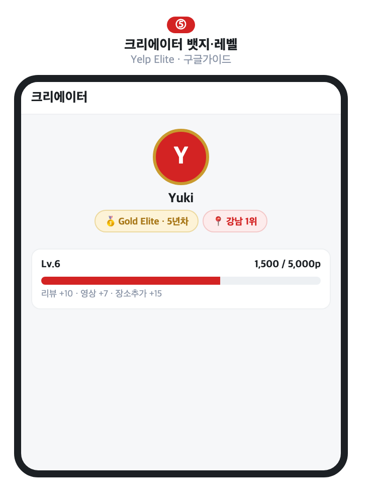

- 명예·등급으로 계속 올리게 만듦
- Yelp: Elite 뱃지, 5년 골드·10년 블랙 / 구글: 점수표·레벨
- **우리**: "충북 뷰티 일짱" 타이틀+뱃지, 첫 뱃지 초반에, 상위는 협찬·모임 초대
- 참고: [Yelp Elite](https://blog.yelp.com/community/how-to-join-the-yelp-elite-squad/) · [구글 로컬가이드](https://support.google.com/maps/answer/6225851)

### 그 외 (필요할 때)
- 국가/카테고리 필터 `(기존)` · 리뷰 자동번역+원문 · 좋아요·댓글·공유 · Q&A(Ask GLOU) · 챌린지·캠페인

---

## 표로 정리

| 구분 | 기능 | 참고 앱 | 우리한테 |
|:--:|---|---|---|
| 핵심 | 숏폼 세로 영상 | 틱톡·릴스·쇼츠 | 영상 풀스크린 + 📍장소 연결 |
| 핵심 | 사진 카드 2열 | 샤오홍슈·레몬8 | 첫 화면 카드 두 줄(국기 표시) |
| 핵심 | 사진 피드형 | 인스타그램 | 팔로우 기반 피드 |
| 부수 | 지역구 일짱 랭킹 | Beli·포스퀘어 | 지역별 1~3위, 주간 리셋 |
| 부수 | 저장→내 지도 | 샤오홍슈·인스타 | 저장을 여행 플래너로 |
| 부수 | 크리에이터 뱃지 | Yelp·구글가이드 | 타이틀·뱃지·초대(돈 안 들이고) |

---

## 참고: 화면을 왜 서구식으로 만드나

- 우리 첫 고객은 영어권 외국인임
- 한국·중국·일본 사이트 = 한 화면에 정보 빽빽(고맥락) / 서구권 = 여백 두고 그림 위주로 단순(저맥락)
- 네이버 블로그처럼 빽빽하게 옮기면 서구 유저는 오히려 "복잡·못 믿겠다"로 느낌
- 그래서 콘텐츠 화면도 여백 넉넉히 · 그림 위주 · 버튼 명확하게

참고: [Würtz, JCMC 2005](https://academic.oup.com/jcmc/article/11/1/274/4616666) · [Nielsen Norman Group](https://www.nngroup.com/articles/crosscultural-design/)

> 리뷰·필터 UX, 외국인 UI 원칙 같은 더 깊은 조사는 `자료/디자인조사_상세원본_0725.md`에 있음.
