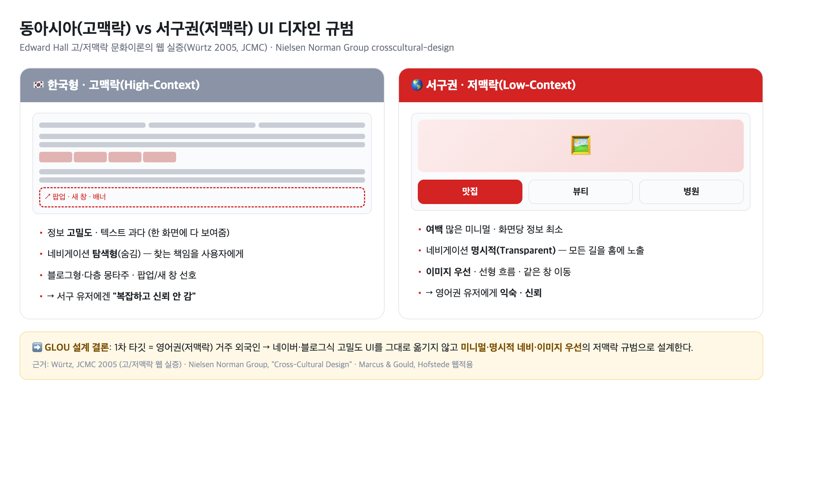
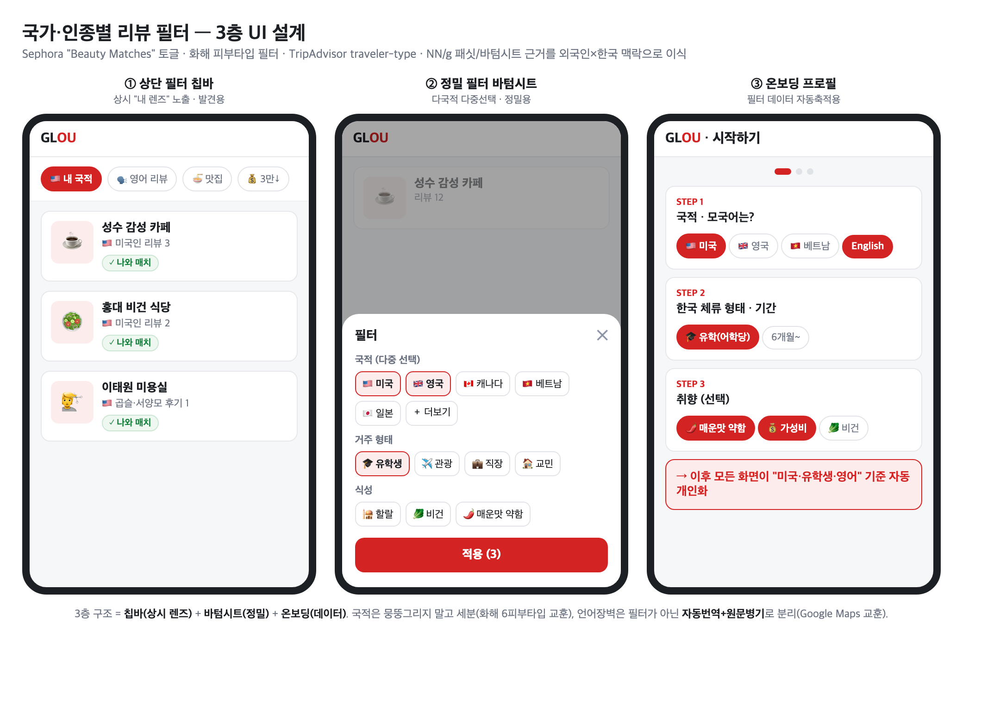
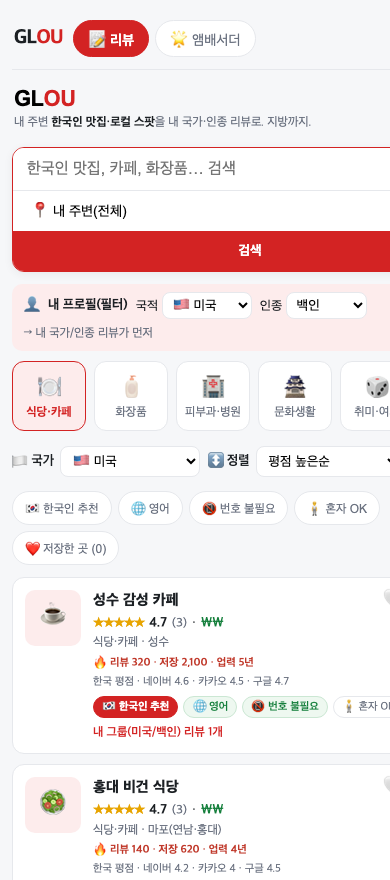
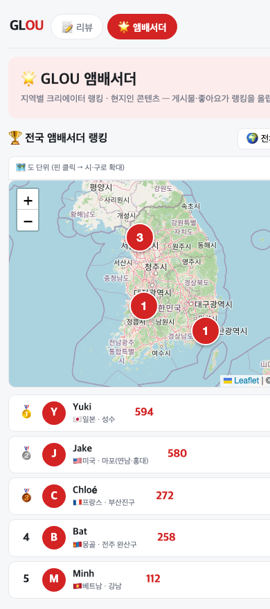

# 디자인 레퍼런스 조사 & 외국인 UI/UX 도출 논리

> 작성: 현준 · 2026-07-25 · (7/26 회의 대비 · 팀 과제 "디자인 레퍼런스 분석 + 외국인 UI/UX 도출 논리")
> 조사 방식: 제미나이 초안을 넘어 **1차 출처(학술·기관·공식문서) 기반으로 재조사·고도화**. 모든 수치·주장에 출처 링크 병기.

## 0. 이 문서의 목적 (강사님 주문)

> "여기 나와있는 것들이 우리나라 고객이 아니라 **해외 고객에게 더 친숙한 UI/UX**로 쓰다 보니 이런 디자인·구성·서비스가 나왔다. **우리는 고객 특성까지 파악해 이런 UX/UI로 설계했다**, 라는 게 나와주면 좋겠다."

즉 이 문서는 세 가지를 논증한다:
1. **왜** 외국인 대상 UI/UX가 한국 앱과 달라야 하는가 (문화·언어 근거)
2. **어떤** 해외 레퍼런스가 그 원리를 구현하고 있는가 (앱별 분석)
3. **그래서** GLOU는 이렇게 설계했다/할 것이다 (설계 결정 + 근거)

---

## 1. 핵심 논지 — 외국인 UI는 "저맥락(Low-Context)" 규범을 따라야 한다

문화인류학자 Edward Hall의 **고맥락/저맥락 이론**을 웹사이트에 실증한 연구(Würtz, *JCMC* 2005)에 따르면, 한국·중국·일본 같은 **고맥락 문화** 사이트는 정보 고밀도·텍스트 과다·탐색형(숨김) 네비게이션·팝업을 선호한다. 반대로 미국·북유럽 같은 **저맥락 문화** 사이트가 선호하는 것은 여백·이미지 우선·명시적(Transparent) 네비게이션·선형 흐름이다. Nielsen Norman Group도 고맥락 문화의 고밀도 선호를 짚는다.

**함의**: GLOU의 1차 타깃은 **영어권(저맥락) 거주 외국인**이다. 네이버 블로그·플랫폼식 고밀도 UI를 그대로 옮기면 서구 유저에겐 "복잡하고 신뢰가 안 가는" 화면이 된다. → GLOU는 **미니멀·명시적 네비·이미지 우선**의 저맥락 규범으로 설계한다.
(근거: Würtz, JCMC [🔗](https://academic.oup.com/jcmc/article/11/1/274/4616666) · NN/g Cross-Cultural Design [🔗](https://www.nngroup.com/articles/crosscultural-design/))

---

## 2. 디자인 레퍼런스 분석

각 앱을 **① 특징 → ② 외국인이 편해하는 이유(근거) → ③ GLOU 적용**으로 분석한다.

### 2-A. 콘텐츠 발견·소비

**샤오홍슈(Xiaohongshu/RED)** — 발견의 교과서
- **특징**: ① **더블 워터폴(2열 masonry)** 피드 — 카드 높이가 제각각이라 크롭 없이 담고, lazy-load 시 기존 카드가 안 밀림(타오바오·징둥이 베낀 표준). ② **커버 썸네일에 텍스트를 얹는** 게 규범(제목=본문 2배 크기, 세로커버 440×580 가이드까지 존재) → 영상 재생 없이 **스캔으로 정보 취득 = 검색엔진화**. ③ **'좋아요'가 아니라 '수집(收藏)'을 1차 액션**으로.
- **외국인 UX 근거**: 언어장벽 유저는 영상보다 **텍스트-온-이미지 스캔**이 빠르고, 여행자는 "나중에 쓸 정보를 모으는" 저장 행동이 본질. (젊은층 ~40%가 점심 장소를 지도앱이 아니라 SNS에서 찾음)
- **GLOU 적용**: 발견 화면은 숏폼 풀스크린이 아니라 **2열 masonry + 텍스트 커버**. '저장(Collect)'을 전면 배치해 개인 여행 플래너化.
- 출처: [🔗](https://en.pingwest.com/a/11673) · [🔗](https://medium.com/@chgnycnyc/xiaohongshu-a-social-media-app-with-search-engine-capabilities-dbd257181306)

**레몬8(Lemon8)** — 바이트댄스의 서구향 샤오홍슈
- **특징**: 가입 시 **6개 관심사(Fashion·Beauty·Food·Wellness·Travel·Home) 온보딩** → For You/Following 2탭. **내장 템플릿·필터**로 초보도 "예쁜 커버"를 뽑게 해 UGC 공급 확보. 해시태그 최대 5개로 제한(스팸 억제).
- **외국인 UX 근거**: 관심사 온보딩으로 **첫 세션부터 개인화 체감**, 제작 템플릿으로 언어·편집 장벽↓.
- **GLOU 적용**: 온보딩에서 국적·취향과 함께 관심 카테고리를 받아 첫 화면부터 개인화. 리뷰/콘텐츠 작성 템플릿 제공.
- 출처: [🔗](https://wavemakerglobal.com/platform-watch/what-brands-need-to-know-about-lemon8)

**틱톡 / 인스타 릴스** — 풀스크린 + 로컬화
- **특징**: ① **우측 세로 액션바**(팔로우·좋아요·저장·공유)는 감이 아니라 **Fitts의 법칙 + 오른손 엄지 통계**(한손 조작 ~67% 오른손 엄지)로 정당화. ② **틱톡 'Nearby' 탭의 결정적 디테일 — 탭 이름을 "Nearby"가 아니라 사용자 위치명("Seoul","Hongdae")으로 표기**. 위치·토픽·최신성 3요소 추천. (영국 유저 ~50%가 틱톡에서 본 로컬 상점을 실제 방문 — Oxford Economics 2023)
- **외국인 UX 근거**: 위치명 탭은 "지금 내 주변에서 뜨는 것"이라는 **FOMO + 실용 검색**을 결합, 언어와 무관하게 직관적.
- **GLOU 적용**: 콘텐츠 탭을 `For You / Following / [Seoul·Hongdae]` 3탭으로, 로컬 탭을 **지역명으로 표기**. 액션바는 세로 배치 + `📍장소 보기` 버튼 강조 → 탭 시 바텀시트로 지도/상세.
- 출처: [🔗](https://newsroom.tiktok.com/tiktok-nearby-discover-whats-happening-around-you) · [🔗](https://www.linkedin.com/pulse/why-tiktoks-ui-amazing-uxui-analysis-series-part-1-mesai-memoria)

### 2-B. 크리에이터 지역 랭킹 · 게이미피케이션 ("지역구 일짱"의 원형)

**Yelp — Elite Squad**
- **특징(구체 규칙)**: 엘리트 6대 자격 = ①실명(성) ②본인 실사진 ③현재 거주 도시 ④음주 가능 연령 ⑤**업주는 자격 불가**(이해충돌 차단) ⑥양질 리뷰·사진. 심사는 본사 **Elite Council**, **매년 초 연간 뱃지**(유지하려면 계속 활동). **5년 = Gold, 10년 = Black 뱃지**(희소성 계단). **엘리트 전용 오프라인 밋업**으로 온라인 활동을 현실 소속감으로 환전.
- **외국인 UX 근거**: 실명·실사진 강제 = **평판이 곧 신분** → 이탈 비용↑. "나 같은 진짜 사람"이 쓴 후기라는 신뢰(→ homophily, §3-9).
- **GLOU 적용**: "현지인 인증 리뷰어" 제도에 이식. 국적·거주 인증, 업주 배제, 연차 뱃지, **지역 밋업 초대**.
- 출처: [🔗](https://blog.yelp.com/community/how-to-join-the-yelp-elite-squad/)

**구글 로컬 가이드** — 정확한 포인트 경제
- **특징(정확 수치)**: 리뷰 10점(200자+ 보너스 +10), 사진 5점, **장소 추가 15점**, 동영상 7점. 레벨: L2=15 · L3=75 · **L4=250(첫 뱃지)** · L6=1,500 · L10=100,000. **초반 계단이 촘촘**(15→75→250)해 빠른 성취, 실물 보상은 대부분 폐지 → **지위 보상만으로 저비용 운영**.
- **외국인 UX 근거**: 행동별 "가격표"는 언어 무관 직관적, "다음 하나만 더" 심리.
- **GLOU 적용**: 명확한 포인트표 + 첫 뱃지를 초반에. 실물 보상 없이 레벨·랭킹만으로 운영(저비용 근거).
- 출처: [🔗](https://support.google.com/maps/answer/6225851)

**Beli** — Gen Z 맛집 랭킹의 교과서 (★ GLOU 콘텐츠랭킹에 가장 유사)
- **특징**: ① **별점 폐지, ELO 비교 랭킹**(체스 레이팅) — "이 집 vs 이미 평가한 집, 어디가 더 좋아?"를 반복해 내 방문 이력을 강제 정렬 → 0~10 개인 점수. ② **친구 궁합(compatibility) %** — 내 취향 벡터 vs 친구. ③ **초대제(waitlist), 80%+ 지인추천 유입**(진성 자기선별) ④ **앱 전체 + 도시별 리더보드** ⑤ **Duolingo식 주간 스트릭**(이번 주 새 랭킹 안 넣으면 순위 하락).
- **외국인 UX 근거**: 비교 랭킹 = **컬렉션 완성 강박**, 주간 리셋 = **손실 회피 리텐션**, 도시 리더보드 = "우리 동네 일짱" 서사.
- **GLOU 적용**: "지역구 일짱"을 **도시별 주간 리셋 리더보드**로. 1~3위 크리에이터 고정 노출. 초대제로 초기 진성 유저 확보. (별점은 유지하되 "취향 매칭 점수"로 진화 경로)
- 출처: [🔗](https://www.today.com/food/trends/what-is-beli-app-rcna217748) · [🔗](https://tastecooking.com/beli-invites-the-loneliest-generation-to-dine-out/)

**Foursquare / Swarm** — 로컬 소유감
- **특징**: **메이어십 = 최근 30일 특정 장소 최다 체크인(하루 1회 카운트, 동점 시 기존 메이어 유지 = 왕좌 방어전)**. 코인·스티커로 친구 한정 주간 리더보드.
- **GLOU 적용**: "이 동네 단골 챔피언(30일 방어)" 서사로 지역 밀착 리텐션. 경쟁은 친구/지역 단위로 국지화(부담↓).
- 출처: [🔗](https://support.foursquare.com/hc/en-us/articles/21163361393948-Fun-with-Swarm-Coins-Mayorship-Collectibles-and-Stickers)

**네이버 마이플레이스** — 국내 반례(중요)
- **특징**: ① **키워드형 정형 리뷰**("양이 많아요" 선택형) → 작성 마찰↓ + 구조화 데이터(누적 1억건). ② **공개 레벨 리더보드를 전면에 두지 않음**. 대신 **영수증 인증 = 네이버페이 50점**(즉각·확정 현금성 보상)으로 첫 리뷰 유도.
- **GLOU 적용**: **게임화 랭킹(장기)과 즉시 현금성 보상(첫 행동)을 이원화**. 리뷰는 키워드 태그로 마찰 최소화.
- 출처: [🔗](https://www.m-i.kr/news/articleView.html?idxno=941609)

**올리브영 '셔터브리티'** — 크리에이터 상향 사다리
- **특징**: 앱인앱 SNS. **셔터브리티 = 올영이 선발·육성하는 ~300명 인플루언서, 연 2회 선발**. 피부톤·타입 동질 유저 팔로우.
- **GLOU 적용**: "현지 앰배서더" 선발제(상향 사다리) + 동질성 매칭.
- 출처: [🔗](https://cjnews.cj.net/올리브영-앱-안의-sns커뮤니티-서비스-셔터로-고객-간/)

### 2-C. "나와 비슷한 사람" 필터 — GLOU 정체성의 원형

**Sephora "Beauty Matches"** — ★ 최상위 벤치마크
- **특징**: 리뷰 섹션에서 **토글 하나("Show reviews from my Beauty Matches")**로 나와 같은 **eye/hair color·hair type·skin tone·skin type**을 가진 사람 리뷰만 필터. 토글을 안 켜도 일치 리뷰어엔 **"Beauty Match" 배지**. 리뷰 작성 시 형질·연령대·지역을 입력받아 **프로필에 저장 → 필터 데이터 자동 축적**.
- **GLOU 적용**: 형질(skin/hair)을 **국적·모국어·거주형태·식성**으로 치환하면 그대로 GLOU. 3단 구조 = ①원터치 토글 ②리뷰어별 매치 배지 ③작성 시 프로필 강제입력을 **그대로 이식**.
- 출처: [🔗](https://www.sephora.com/beauty/ratings-reviews)

**화해** — 국내 검증
- **특징**: 6개 피부타입(수부지·악건성 등 한국 특화까지 세분) 기반 "나와 비슷한 피부타입" 리뷰만 필터. → **세분화가 곧 신뢰**.
- **GLOU 적용**: 국적을 뭉뚱그리지 말 것(서구권도 미국·영국·호주로 세분).
- 출처: [🔗](https://brunch.co.kr/@easyhoon/11)

**TripAdvisor** — 국적·언어 필터의 원형
- **특징**: 리뷰를 **Traveler Type(Families·Couples·Solo·Business·Friends)·언어·시기·평점**으로 필터. 외국인이 "나와 같은 언어권 사람 리뷰"만 골라봄.
- **GLOU 적용**: "traveler type" 자리에 **국적/거주형태(관광·유학·워홀·직장·교민)**를 넣으면 이식 완료. "영어 리뷰만" 토글은 MVP 저비용 기능.
- 출처: [🔗](https://dataforseo.com/update/filters-sorting-in-tripadvisor-reviews-api)

> ⚠️ **언어장벽 ≠ 국적 필터**: Google Maps는 리뷰를 **자동번역 + 원문 병기**로 처리(2017~). GLOU도 "국적 필터"와 "언어 자동번역"은 **별개 기능**으로 분리 — 뉘앙스 손실 방지 위해 원문 병기. [🔗](https://blog.google/products/maps/local-reviews-your-language-wherever-you-are/)

### 2-D. 외국인 한국생활 콘텐츠 서비스 (경쟁사 · 콘텐츠 관점)

강사님 지적("리뷰뿐 아니라 콘텐츠도 제공하니 경쟁사를 더 포괄적으로")에 대한 답.

**Creatrip** — ★ 직접 근접 경쟁
- **특징**: 7~14개 언어 K-트렌드 큐레이션(맛집·뷰티·유학), 월 방문 170만·SNS 150만+. 문제정의가 GLOU와 동일("외국인이 언어·문화 장벽으로 같은 곳만 가고 바가지"). **단, 리뷰가 에디터 톱다운·개인화 필터 약함**.
- **GLOU 차별 포지션**: Creatrip=에디터 큐레이션+커머스 → GLOU=**UGC 로컬 리뷰 + 국적/인종 필터**. 이 축에서 갈라야 함.
- 출처: [🔗](https://www.unicornfactory.co.kr/article/2025121610213280802)

**코리아넷 명예기자단**(문체부/KOCIS) — ★ "국가별 리포터"의 정부 검증 모델
- **특징**: 2011년~ (2026년 16기). **106개국 1,543명 선발**(국가 쿼터형), 우수 기사는 정부 다국어 포털에 **10개 언어** 게재. 누적 1.9만명.
- **GLOU 적용**: "국가별 대표 리포터 + 우수 콘텐츠 큐레이션" 모델. 초기 콘텐츠 확보 시 이 인력풀과 제휴/벤치 가능.
- 출처: [🔗](https://www.korean.net/portal/global/pg_news_local.do)

**재외동포청 '동포ON' 글로벌 리포터** — 🔧 기존 사업계획서 **정정 필요**
- **정정**: 공개 자료에 **점수형 "국가별 랭킹(리더보드)" 제도는 확인되지 않음**. 존재하는 건 **국가 대표성 기반 선발(1차 ~50명 → 최종 10명) + 국가별 통신원 배치**까지. → 사업계획서에서 "동포ON = 국가별 랭킹"으로 쓴 부분은 **"국가별 통신원 선발" 또는 코리아넷 명예기자단(국가 쿼터)**으로 교체 권장.
- **GLOU 적용**: "국가별 로컬 앰배서더" 프레임("미국인이 쓴 한국생활 팁")은 유효.
- 출처: [🔗](https://www.oka.go.kr/web/board/brdDetail.do?menu_cd=000018&num=4134)

**Reddit r/Living_in_Korea, r/korea** — UGC 원천(기회)
- **특징**: 외국인 거주자가 실생활 팁을 공유하는 수요가 이미 존재. 단 **검색·필터·국적 태깅이 약한 텍스트 스레드**(파편적·비구조적).
- **GLOU 적용**: 이 수요를 **국적 필터 + 지도/맛집 구조화 UI**로 흡수하는 게 진입 전략. Reddit의 비구조성 = GLOU의 기회.
- 출처: [🔗](https://www.reddit.com/r/Living_in_Korea/)

---

## 3. 외국인 UI/UX 설계 10원칙 (근거 → 우리 설계)

강사님이 원한 "**외국인은 이런 UI/UX가 익숙 → 그래서 우리는 이렇게 설계**"의 논리 뼈대. 각 원칙에 1차 근거를 붙였다.

| # | 설계 원칙 | 근거 (출처) |
|---|---|---|
| 1 | **여백·미니멀**하게 (고밀도 금지) | 저맥락은 고밀도를 "복잡·불신"으로 읽음 — Würtz JCMC / NN/g |
| 2 | **명시적 네비(Transparent)** — 홈에 모든 길 노출 | 저맥락은 명시적, 고맥락은 탐색형 선호 — Würtz JCMC |
| 3 | **텍스트보다 사진·이미지 우선** | 언어장벽·고맥락 유저 모두 이미지 우선 — JCMC / 저문해 UX |
| 4 | **아이콘엔 반드시 텍스트 라벨 병기** | 추상 아이콘은 문화·문해 장벽 못 넘음 — W3C / 저문해 아이콘 연구 |
| 5 | **언어 선택은 국기 대신 자기명칭**("English/日本語") | 국기는 국가지 언어 아님 + 국수주의 함의 — [W3C](https://www.w3.org/International/questions/qa-link-lang.en.html) |
| 6 | **UI는 텍스트 확장 200% 견디게** | 번역 시 짧은 라벨 100~300% 확장 — [W3C i18n](https://www.w3.org/International/quicktips/) |
| 7 | **6~8학년 수준 plain English** | 쉬운 문장=번역 쉽고 비원어민 인지부하↓ — [NN/g](https://www.nngroup.com/videos/simple-clear-language-improves-ux/) |
| 8 | **검색창보다 시각적 브라우즈·필터 칩** | 언어장벽 유저는 타이핑보다 시각 탐색 선호 — [Algolia](https://www.algolia.com/blog/ux/search-filter-ux-best-practices) |
| 9 | **별점만 말고 서술형 후기 + "나 같은 사람" 필터** | 97%가 텍스트 후기 선호, "people like me" 73% 신뢰(homophily) — [Yelp 설문](https://blog.yelp.com/news/survey-finds-what-makes-reviews-trustworthy-consumers-want-more-than-ratings/) |
| 10 | **인증 벽 대신 게스트 모드·소셜 로그인·해외카드** | 한국식 실명·휴대폰 인증은 외국인 진입의 구조적 장벽 — [사례](https://all-about-korea.com/korean-apps-for-tourists-verification-wall/) / Ping Identity |

> 특히 9·10은 GLOU의 **차별점**과 직결: (9)는 "국가·인종 필터"의 학술 근거(homophily·동종선호), (10)은 시장조사 결론(네이버 여권인증 리스크)과 정합.

---

## 4. GLOU 설계 결정 — 레퍼런스를 우리 화면으로

### 4-1. 국가·인종별 리뷰 필터 — 3층 UI 설계

Sephora 토글 + 화해 세분화 + TripAdvisor traveler-type + NN/g 패싯/바텀시트 근거를 **외국인×한국** 맥락으로 이식한 결과.

- **① 상단 필터 칩바** (상시 "내 렌즈") — `[🇺🇸 내 국적][🗣️ 영어 리뷰][🍜 맛집]` 가로 스크롤. 첫 칩 = 원터치 "내 국적만" 토글(Sephora). 리뷰 카드마다 국기 + **"나와 매치" 배지**. → 패싯 필터는 과업을 25~50% 빠르게(NN/g).
- **② 정밀 필터 바텀시트** — 국적(다중선택 국기 그리드)·거주형태·식성·예산. 하단 `[적용 (N)]` + 상단 **명시적 ✕**(NN/g: 스와이프 의존 금지). 자주 쓰는 국적은 상단 "빠른 선택".
- **③ 온보딩 프로필** — 가입 3스텝(국적/모국어 → 체류형태·기간 → 취향) → 이후 화면 자동 개인화 + 리뷰 작성 시 프로필 자동 부착(**필터 데이터 UGC로 자동 축적**).

### 4-2. 콘텐츠 소비 공간 설계 ([현준] 콘텐츠 기능 과제)

두 공간으로 분리:
- **A. 디스커버리(통합)**: **2열 masonry + 텍스트 커버**(샤오홍슈) · `For You / Following / [지역명]` 3탭(틱톡 Nearby) · **저장(Collect) 1차 액션**(개인 여행 플래너化) · **키워드형 정형 리뷰**(네이버, 작성 마찰↓).
- **B. 지역구 라운지(랭킹)**: 하단 `🏆` 탭. 지역(서울 강남구·충북 청주) 선택 → **이번 주 1~3위 고정 노출** + 그들의 로컬 후기. 엔진 = **Beli식 도시별 주간 리셋 리더보드 + Yelp Elite 초대제(오프라인 밋업) + 구글 로컬가이드식 포인트표**. 보상은 **게임화(장기) + 즉시 현금성(첫 행동)** 이원화(네이버 교훈).

### 4-3. 이미 프로토타입에 반영된 것 (= "우리는 이렇게 설계했다"의 증거)

- **명시적 필터 노출**(저맥락 원칙 2·8): 국가/인종 프로필 필터·카테고리 칩·정렬을 **홈에 다 보여줌**(숨김형 아님).
- **이미지 카드 + 배지**(원칙 3·4): 텍스트 아이콘엔 라벨 병기(🌐영어·번호불필요·혼밥 OK).
- **"나와 매치" 신호**(원칙 9): "내 그룹(미국/백인) 리뷰 1개" 표시 = homophily UI.

- **지역 앰배서더 랭킹 + 드릴다운 지도** = Beli 도시 리더보드 / 구글 로컬가이드 방향의 초기 구현. → 여기에 **주간 리셋·초대제·포인트표**를 얹으면 §4-2-B 완성.

---

## 5. 콘텐츠 기능 로드맵 — "바로 적용" Top 8

| 우선 | 기능 | 레퍼런스 | 외국인 UX 근거 |
|:--:|---|---|---|
| MVP | 2열 masonry + 텍스트 커버 발견 피드 | 샤오홍슈 | 스캔·검색엔진화 |
| MVP | 국적/언어 필터 칩바 + "나와 매치" 배지 | Sephora·TripAdvisor | homophily·패싯 |
| MVP | 키워드형 정형 리뷰 | 네이버 마이플레이스 | 작성 마찰↓ |
| MVP | 리뷰 자동번역 + 원문 병기 | Google Maps | 언어장벽 분리 |
| R2 | 지역명 'Nearby' 탭 + 저장(Collect) | 틱톡·샤오홍슈 | 로컬 발견·플래너 |
| R2 | 도시별 주간 리셋 리더보드(지역구 일짱) | Beli·Foursquare | 손실회피·로컬 소유감 |
| R2 | 포인트표 + 초반 급경사 레벨/뱃지 | 구글 로컬가이드 | 저비용 지위 보상 |
| R3 | 현지인 앰배서더 엘리트 초대제(오프라인 밋업) | Yelp Elite·셔터브리티 | 평판=신분 리텐션 |

---

## 6. 부록 — 레퍼런스 요약표

| 앱 | 벤치마킹 포인트 | GLOU 적용 |
|---|---|---|
| 샤오홍슈 | 2열 masonry·텍스트커버·저장우선·검색엔진화 | 발견 피드 |
| 레몬8 | 관심사 온보딩·제작 템플릿 | 온보딩·작성 |
| 틱톡/릴스 | 지역명 Nearby 탭·세로 액션바·무한추천 | 콘텐츠 탭 |
| Yelp Elite | 실명·업주배제·연차뱃지·오프라인 초대제 | 앰배서더 제도 |
| 구글 로컬가이드 | 포인트표·초반급경사 레벨·지위보상 | 게임화 |
| Beli | ELO 비교랭킹·주간스트릭·도시 리더보드·초대제 | 지역구 랭킹 |
| Foursquare | 메이어십(30일 방어전) | 로컬 소유감 |
| 네이버 마이플레이스 | 키워드리뷰·영수증=현금보상(반례) | 리뷰·보상 이원화 |
| Sephora Beauty Matches | 5형질 토글·매치배지·프로필 강제입력 | 국가/인종 필터 3층 |
| 화해 | 6피부타입 세분 | 국적 세분화 |
| TripAdvisor | traveler type·언어 필터 | 필터 축 |
| Creatrip | 다국어 큐레이션(에디터 톱다운) | 차별 포지션 |
| 코리아넷 명예기자단 | 106개국 쿼터·다국어 게재 | 국가별 리포터 |
| Reddit r/Living_in_Korea | 파편적 UGC 수요 | 구조화로 흡수 |

## 7. 조사 한계 (정직하게)
- **동포ON 글로벌 리포터의 점수형 "국가별 랭킹"은 실재 확인 불가** — 국가 대표성 선발+통신원 배치까지만. 사업계획서 인용 시 코리아넷 명예기자단(국가 쿼터)으로 대체 권장.
- Sephora Beauty Matches 공식 페이지는 접근 차단으로 검색 스니펫 교차확인. 나머지(TripAdvisor·NN/g·틱톡·구글·Yelp·Beli)는 공식/1차 출처 확인.
- 전환율 일부 수치(소셜로그인 선호 77% 등)는 업계 블로그 출처 → 계획서엔 "업계 보고"로 표기 권장. Würtz(JCMC)·W3C·NN/g·Yelp·Vanderbilt는 1차/권위 출처로 안심 인용 가능.

<!-- HUMANIZE-PASS (in-place, 2026-07-25)
목적: 한국어 산문·문장의 AI 티만 제거. 마크다운 구조(헤딩·표·불릿·이미지·링크)·수치·고유명사·앱이름·영어 용어·인용·의미는 100% 보존.
소견: 문서 자체 헤더대로 저자가 제미나이 초안을 1차 출처로 재작성한 상태라 AI 티가 이미 희소. 표·링크가 다수라 산문 문장에만 국소 개입.
변경 내역:
  - §1 본문 1문장: 기계적 병렬 "선호하고, … 선호한다"(+ 연결어미 뒤 쉼표, C-11)를 2문장으로 분리하고 두 번째를 "선호하는 것은 …이다"로 변주. 번역투 만능동사 "문서화한다"(A-15)를 "짚는다"로 환원. 의미·출처 불변.
미개입(의도적 보존): 특징/근거/적용 3단 불릿 프레임(기능적 구조), 저자 고유 축약어("검색엔진화"·"플래너化"·"환전" 은유), 표 셀 내 짧은 구.
자체검증: 수치·날짜·고유명사·인용·표·링크 전량 보존 ✅ / register(선언형) 유지 ✅ / 장르(내부 리포트) 유지 ✅ / 변경률 <2% ✅ / 잔존 S1 0건 ✅ / 임의 수사 추가 없음 ✅
등급: A (S1 잔존 0, 변경률 극소, 자체검증 6/6)
-->
