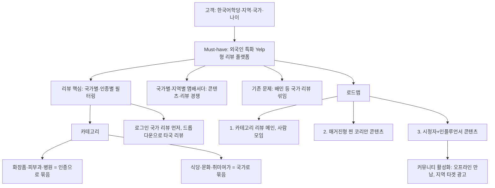

# [2026-07-11] 신촌 멘토링 2 — 서비스 결정: 외국인 특화 로컬 리뷰 플랫폼 (Yelp형)

> 이날 **손그림 도식 + 논의**를 정리. **결정(Must-have): "외국인이 보기 편한 UI로 한국 로컬 콘텐츠를 쉽게 접하는, 국가·인종별로 특화된 Yelp형 리뷰 플랫폼."**
> 손그림 원본은 사진(별도). 아래 §2에 Mermaid로 옮김. 정리 전 타이핑 메모는 맨 아래 [§원본 보존](#원본-보존-타이핑-메모). · 정리 2026-07-12

---

## 0. 결정 (Must-have / Good-to-have)

- **Must-have**: 외국인 특화 UI + 한국 로컬 콘텐츠를 쉽게 보는 플랫폼 = **Yelp형 리뷰 서비스(외국인 특화).**
- **차별점**: 리뷰를 **국가별·인종별로 필터링** → 문화·인종 맞춤 정보.
  - 예: 일본인은 좋아하는 식당을 베트남인은 정말 싫어함 / 흰 피부 서양인엔 좋은 화장품이 흑인엔 효과가 약함.

## 1. 고객

**한국어학당 유학생** · **지역(비수도권) 체류** · **국가별** · **나이**.

## 2. 핵심 서비스 구조 (손그림 도식 → Mermaid)




> 📄 위 다이어그램이 **빈 칸으로만** 보이면 → [mermaid.live](https://mermaid.live) 에 위 코드를 붙여넣거나, 아래 **텍스트 트리**로 구조를 확인하세요(어떤 뷰어에서도 보임):

```text
고객 (한국어학당 · 지역 · 국가 · 나이)
 └─ ⭐ Must-have : 외국인 특화 Yelp형 리뷰 플랫폼
     ├─ 리뷰 [핵심] : 국가별 · 인종별 필터링
     │   ├─ 카테고리
     │   │   ├─ 화장품 · 피부과 · 병원  →  인종으로 묶음
     │   │   └─ 식당 · 문화 · 취미여가   →  국가로 묶음
     │   └─ 노출 : 로그인 국가 리뷰 먼저 → 드롭다운으로 타국 리뷰
     ├─ 앰배서더 : 국가별 · 지역별, 콘텐츠 · 리뷰 경쟁
     ├─ 기존 문제 : 배민 등 국가 리뷰 섞임  ← 차별점
     └─ 로드맵
         1. 카테고리 리뷰(메인) → 사람 모임
         2. 매거진형 '찐 코리안' 콘텐츠
         3. 시청자 + 인플루언서 콘텐츠
             └─ 커뮤니티 활성화 → 오프라인 만남 / 지역 타겟 광고 (수익화는 나중)
```

**⭐ 묶음 규칙 (스키마 설계에 그대로 반영할 핵심 결정):**
| 카테고리 | 묶는 기준 | 이유 |
|---|---|---|
| 화장품 · 피부과(병원) | **인종(race)** | 피부·체질이 인종에 종속 |
| 식당(카페) · 문화생활 · 취미·여가 | **국가(country)** | 입맛·취향이 국가에 종속 |

- **리뷰 노출 로직**: 로그인한 사용자의 **국가 리뷰가 처음** 보이고, 드롭다운/스크롤로 **다른 나라 리뷰**도 검색.

## 3. 앰배서더 시스템

- 국가별/지역별 **앰배서더 선정** → 그 안에서 콘텐츠·리뷰 **선의의 경쟁** 유도.
  - 동기 예시: 몽골처럼 한국 앰배서더가 적은 지역은 "내가 가면 그 지역 대표 앰배서더 될 수도?"라는 자신감 → 참여 유인.
- 리뷰 화면에서 **그 장소를 다녀온 앰배서더의 콘텐츠**를 볼 수 있게.
- ⚠️ **열린 질문 (정해야 함)**:
  1. 앰배서더를 **우리가 직접/자체 선정?**
  2. **한국인으로 할까?** (외국인이 궁금해하는 "진짜 코리안 라이프"를 생생히 전달) → **한국인으로 하면 한국인을 플랫폼에 유입시킬 전략 필요.** _(손메모의 "CP ← 유인 전략"이 이 뜻으로 추정. CP 정확한 의미는 미상 — 확인 필요.)_
  3. **필터링 기준**: 지역당 최대 N명 제한 / 콘텐츠·활동 최소 조건 (콘텐츠가 너무 적은데 아무나 앰배서더 되면 곤란).

## 4. 로드맵 (커뮤니티 → 수익화)

1. **카테고리 리뷰(메인)** — 음식점·화장품 등 리뷰가 중심 → 사람이 모임.
2. **매거진형 '찐 코리안' 콘텐츠 발행** — 우리가 직접 발행.
3. 유입 늘면 **시청자 + 인플루언서 참여 콘텐츠**(매거진형·틱톡형 영상·라이프스타일).
   → 커뮤니티가 활성화되면 **오프라인 만남** 또는 **지역 외국인 타겟 광고**. **수익화 모델은 나중에 붙임.**

## 5. 근거 & ⚠️ 검증할 가정

- **근거**: 외국인의 한국 관심↑ → 어학당 다니며 체류 → 수도권이 비싸 **필연적으로 지방 이동** → 그런데 **인프라·정보는 수도권 집중**, 수도권은 정보 과다·지방은 부족.
- ⚠️ **"지방은 정보가 얼마 없다"는 근거 없는 개인 견해** (작성자 명시). → **반드시 데이터로 검증**: 지역별 외국인 비율 + 지방 외국인 대상 정보 서비스 실태. (→ [hypotheses](../../data/research/interviews/hypotheses.md) 연계, 모두의창업 "지역 활성화" 각도와 맞음)

## 6. 기존 서비스 문제점 (= 우리 차별점 근거)

- **배민 등**: 국가 리뷰가 **섞여 있음**(일본어·영어 뒤죽박죽) → **국가·언어·인종별 정리**가 우리 차별점.
- 경쟁사(기존 서비스 문제점) 추가 조사 필요. (→ [04_competitors_korea](../../data/research/market/04_competitors_korea.md), 신규 전략자료 22개 경쟁사)

## 7. 다음 액션

- [x] 미팅 기록 정리 (이 문서)
- [ ] **Yelp 메인 서비스 벤치마킹 → 프론트 + 간단 기능 MVP 구현**
- [ ] **DB 스키마 설계** (§2 묶음 규칙: 화장품·병원=인종 / 식당·문화·여가=국가 반영)
- [ ] 지역별 외국인 비율 데이터 확보(근거 보강)
- [ ] 앰배서더 정책 확정(선정 방식·필터·한국인 여부·유입 전략)

## 8. ⚠️ 다른 자료와의 관계

- 이 결정(Yelp형 리뷰 플랫폼)은 07/11 전략자료의 **"정착 온보딩 OS"와 다른 갈래**임. 둘 다 거주 외국인 타겟이지만, 이쪽은 **리뷰·콘텐츠·커뮤니티** 중심, 전략자료는 **주거·SIM·송금 정착** 중심. → 팀이 **리뷰 플랫폼으로 방향을 좁힌 것**으로 보이며, [종합\_요약](../business/종합_요약_2026-07-11.md)·[서비스*방향*결정](../business/서비스_방향_결정_2026-07.md)에 반영 필요.
- 합류: "국가·인종별 리뷰 + 신뢰 설계" = [13_review_integrity](../../data/research/market/13_review_integrity.md) · Notion GLOU Map/Foreigner-Fit.

---

## 원본 보존 (타이핑 메모)

> ※ 이 타이핑 메모는 손그림 도식과 **별개**로 작성됐던 텍스트 노트. 손대지 않고 보존.

```text
카테고리별로 어떤 서비스를 제공할 수 있는지 쭉 리스트업. Must to have / Nice to have 생각하면서.
어학당 한국어 배우며 그 지역 정보가 필요한 상황. 인종/피부타입(생활 콘텐츠는 지역으로).
창업 때 must/nice 구분해 순위. 정보 너무 많은 것도 문제. solution에서 must have 정해 구심점으로 확장.

- 메모
  1. 지역 별 외국인 유입 정책
  2. 대학 별로 외국인 유치 전략 많고
  3. 한국어학당은 비자 받으려면 수도권이 비싸 지역으로 가서 공부·체류할 수밖에 없다 → 지역 체류 외국인 많다는 걸 베이스로 기획
  4. 그럼에도 서비스는 수도권·관광지 중심 + 인종/국가별 문화·식생활 차이 고려한 그들끼리의 리뷰 필요

지역별 외국인 비율 조사·정리 필요 (모두의 창업이 좋아할 지역 활성화 전략).

서비스 확정: 지역/플랫폼별 리뷰(네이버·카카오) — 외국인 리뷰 나라별 / 본인 나라 리뷰 카테고리·내적친밀감·리뷰경쟁 /
크리에이터 나라별 지역 짱(랭킹·앰배서더) / 퀄리티 검열 장치 / 글로벌 크리에이터 콘텐츠(틱톡·유튜브·인스타)
취업·포트폴리오 한국어 피드백→지역 채용 / 한국어 정착(뉘앙스·그림·낱말·사투리 퀴즈, 오답률 블로그화) /
매거진 구독형 / 배너광고 / 쿠팡 필수제품 / 동선·시간 최적화 / AI 크리에이터 매니저 /
주거 대행(층간소음·집수리) / 피부과 민원 대행 / B2B 데이터 / 블라인드(직장) /
뷰티 키트(피부색 RGB·퍼컬·성분·테스트지·뷰티 플래너) / 우슐랭(맛집) / 대외활동 프로젝트
추가 수익성 방안 구상 / PSST 사업계획서 작성
```
