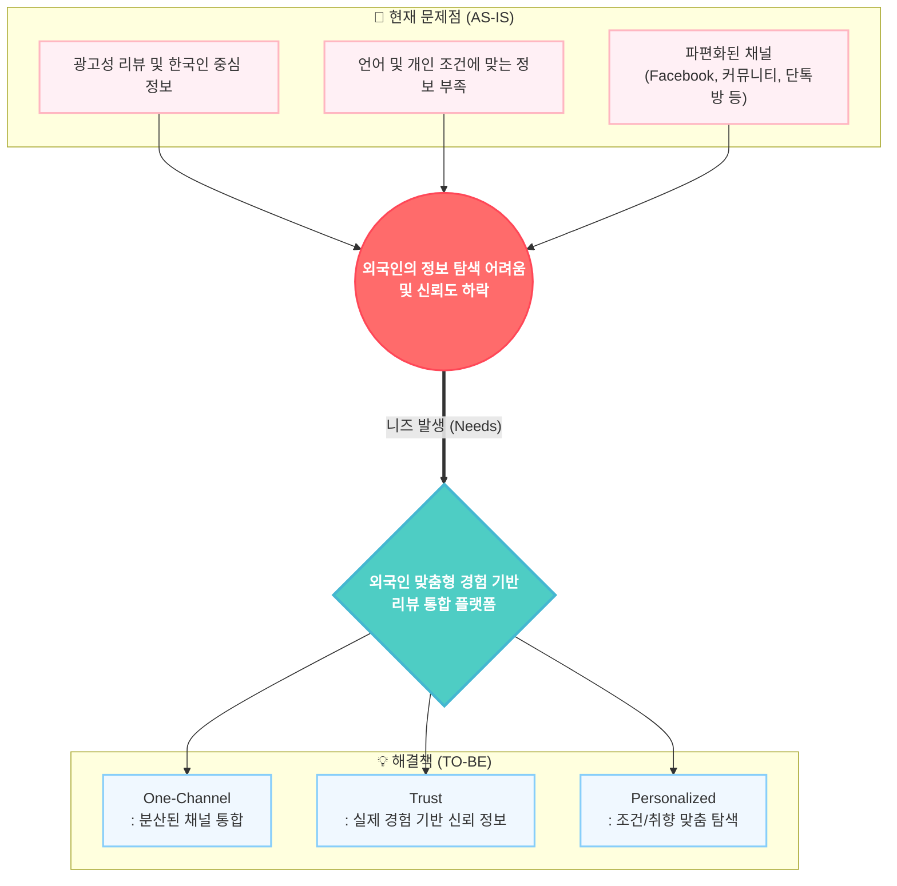

```mermaid
flowchart TD
    %% 스타일 정의
    classDef problem fill:#FFF0F5,stroke:#FFB6C1,stroke-width:2px,color:#333
    classDef painpoint fill:#FF6B6B,stroke:#FF4757,stroke-width:2px,color:#FFF,font-weight:bold
    classDef solution fill:#F0F8FF,stroke:#87CEFA,stroke-width:2px,color:#333
    classDef core fill:#4ECDC4,stroke:#45B7D1,stroke-width:3px,color:#FFF,font-weight:bold

    subgraph ASIS ["🚨 현재 문제점 (AS-IS)"]
        A1["광고성 리뷰 및 한국인 중심 정보"]
        A2["언어 및 개인 조건에 맞는 정보 부족"]
        A3["파편화된 채널<br/>(Facebook, 커뮤니티, 단톡방 등)"]
    end

    A1 & A2 & A3 --> B(("외국인의 정보 탐색 어려움<br/>및 신뢰도 하락"))

    B == "니즈 발생 (Needs)" ===> C{"외국인 맞춤형 경험 기반<br/>리뷰 통합 플랫폼"}

    subgraph TOBE ["💡 해결책 (TO-BE)"]
        D1["One-Channel<br/>: 분산된 채널 통합"]
        D2["Trust<br/>: 실제 경험 기반 신뢰 정보"]
        D3["Personalized<br/>: 조건/취향 맞춤 탐색"]
    end

    C --> D1
    C --> D2
    C --> D3

    %% 클래스 일괄 적용 (구버전 파서 호환을 위해 분리)
    class A1,A2,A3 problem
    class B painpoint
    class C core
    class D1,D2,D3 solution
```
